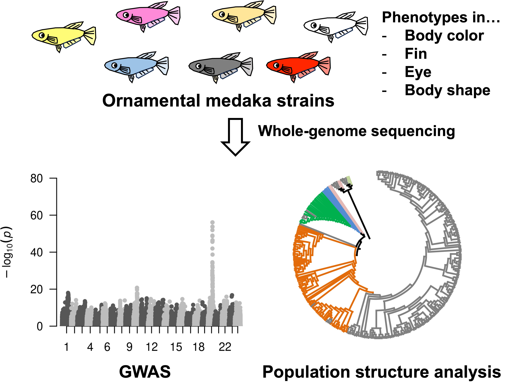
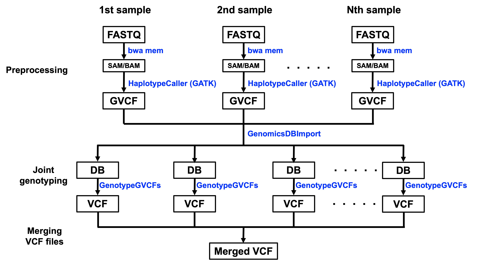

# Whole genome sequencing of ornamental medaka strains

Ornamental medaka strains derived from wild Japanese medaka (Oryzias latipes species complex) are bred worldwide. Over 200 years of selective breeding have produced over 700 strains with a wide variety of phenotypes, including diverse body coloration, scales, eyeball morphology, and fin and body shapes. Here, we performed whole-genome sequencing analysis of ornamental medaka strains with diverse phenotypes.
  
__Contributors__
Tetsuo Kon, Rui Tang, Koto Kon-Nanjyo, Soichiro Fushiki, Hideki Noguchi, Atsushi Toyoda, Kiyoshi Naruse, Yoshihiro Omori

## Software requirements
Thi is the software requirements to perform analyses.
- [List of required softwares](./software_requirements.md)
- [List of references for softwares](./references.md)
## Data source
This section describes data source for the analyses
- [List of data source](./Data_source.md)  
## Variant calling
- [Quality control analysis of the short reads](./QC_nanopore.md)
- [Read mapping](./Read_mapping.md)
- [Individual variant calling for generating GVCF files](./Individual_variant_calling.md)
- [Joint variant calling for generating VCF files](./Joint_variant_calling.md)

